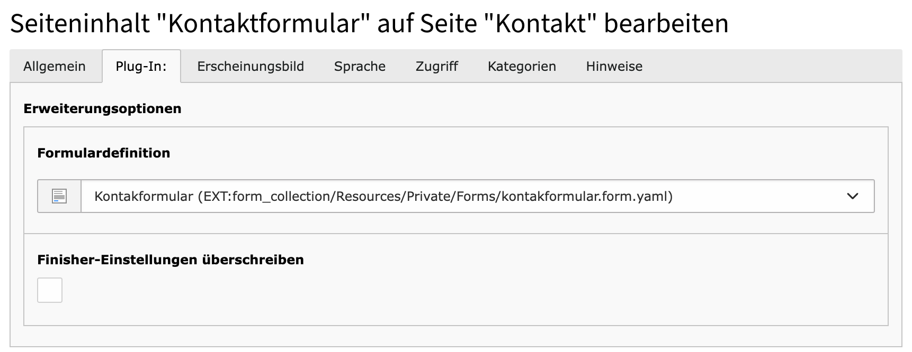

# form_collection
I struggled with TYPO3 forms for a long time and refused to use or update it, because there is no documentation that just works. But I needed to integrate a newsletter subscription form for Brevo and there was a finished integration from studiomitte, so I needed to dig into this topic, and made a full template extension just for T3:Forms, that can be used for tutorials or as a fork for your own projects.

## Installation

1. Install via composer

```composer req bokuno/form-collection```

2. Load TypoScript from Extension "form" and "form_collection" 


3. Clear Cache
4. As the contact form is already present you can simply use it in the form plugin
